  

  

## 📌 About Me
- 🌱 AI & ML undergraduate passionate about solving real-world problems with Artificial Intelligence.
- 🚀 Building AI-powered products using Machine Learning, LLMs, and Agentic AI.
- 💻 Love turning ideas into scalable applications through code and innovation.
- 🤝 Open to collaborating on AI, Open Source, and Hackathon projects.
- 🎯 Goal: To become an AI/ML Engineer & Researcher building next-generation intelligent systems.

## 🧠 My Focus Areas
- Machine Learning
- Deep Learning
- Generative AI
- Large Language Models (LLMs)
- Agentic AI
- Multi-Agent Systems
- Retrieval-Augmented Generation (RAG)
- MLOps
- FastAPI & Backend Development
- Open Source

## 📊 GitHub Stats & Trophies

  
  
    

  

  

  

  

## 🛠️ Languages & Tools

<h3 align="center">Programming Languages</h3>

  &nbsp;&nbsp;&nbsp;&nbsp;&nbsp;&nbsp;
  &nbsp;&nbsp;&nbsp;&nbsp;&nbsp;&nbsp;
  &nbsp;&nbsp;&nbsp;&nbsp;&nbsp;&nbsp;
  

<h3 align="center">Frontend</h3>

  &nbsp;&nbsp;&nbsp;&nbsp;&nbsp;&nbsp;
  &nbsp;&nbsp;&nbsp;&nbsp;&nbsp;&nbsp;
  &nbsp;&nbsp;&nbsp;&nbsp;&nbsp;&nbsp;
  

<h3 align="center">Backend</h3>

  &nbsp;&nbsp;&nbsp;&nbsp;&nbsp;&nbsp;
  

<h3 align="center">Database</h3>

  &nbsp;&nbsp;&nbsp;&nbsp;&nbsp;&nbsp;
  &nbsp;&nbsp;&nbsp;&nbsp;&nbsp;&nbsp;
  &nbsp;&nbsp;&nbsp;&nbsp;&nbsp;&nbsp;
  

<h3 align="center">DevOps & Cloud</h3>

  &nbsp;&nbsp;&nbsp;&nbsp;&nbsp;&nbsp;
  

<h3 align="center">Tools</h3>

  &nbsp;&nbsp;&nbsp;&nbsp;&nbsp;&nbsp;
  &nbsp;&nbsp;&nbsp;&nbsp;&nbsp;&nbsp;
  &nbsp;&nbsp;&nbsp;&nbsp;&nbsp;&nbsp;
  

## 🛠️ Top Languages & Tools

 

## 🔗 Connect with Me

  &nbsp;&nbsp;&nbsp;
  &nbsp;&nbsp;&nbsp;
  

<picture>
  <source media="(prefers-color-scheme: dark)" srcset="https://raw.githubusercontent.com/abozanona/abozanona/output/pacman-contribution-graph-dark.svg">
  <source media="(prefers-color-scheme: light)" srcset="https://raw.githubusercontent.com/abozanona/abozanona/output/pacman-contribution-graph.svg">
  
</picture>

  

